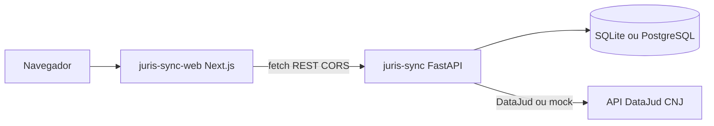
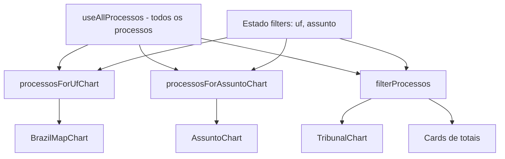
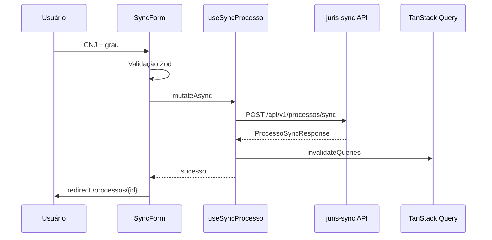

# Arquitetura - JurisSync Web

## Visão geral

O **juris-sync-web** é um cliente HTTP que consome a API FastAPI do **juris-sync**. Não há código Python no frontend nem importação cruzada entre repositórios - apenas contrato REST/OpenAPI.



---

## Estrutura de pastas

```
src/
├── app/                         # App Router
│   ├── layout.tsx               # Header fixo + QueryProvider
│   ├── page.tsx                 # Visão Geral (/)
│   └── processos/
│       ├── page.tsx             # Lista + sync
│       └── [id]/page.tsx        # Detalhe
├── components/
│   ├── charts/
│   │   ├── BrazilMapChart.tsx   # Mapa choropleth (d3-geo) + ranking UF
│   │   ├── TribunalChart.tsx    # Recharts
│   │   ├── AssuntoChart.tsx     # Recharts + seleção
│   │   └── ChartEmpty.tsx
│   ├── dashboard/
│   │   └── DashboardView.tsx    # KPIs, filtros cruzados, composição
│   ├── layout/
│   │   ├── AppHeader.tsx        # Nav fixa (lucide-react)
│   │   └── PageContainer.tsx
│   ├── processos/               # Sync, tabela, timeline, filtros
│   ├── providers/
│   │   └── QueryProvider.tsx
│   └── ui/                      # Button, Input, Alert, Badge...
├── hooks/
│   ├── useAllProcessos.ts       # Paginação completa para jurimetria
│   ├── useHealth.ts
│   ├── useProcessos.ts
│   ├── useProcesso.ts
│   ├── useSyncProcesso.ts
│   ├── useStatsTribunal.ts      # Legado; não usado na home
│   └── useStatsAssunto.ts       # Legado; não usado na home
└── lib/
    ├── api/                     # client, endpoints, types
    ├── jurimetria.ts            # Cross-filter + agregações
    ├── tribunal-uf.ts           # TJ* → UF
    ├── validators/cnj.ts
    ├── errors.ts
    └── query-keys.ts

public/
└── geo/
    └── brazil-states.geojson    # GeoJSON dos estados (mapa)
```

---

## Camadas e responsabilidades

### `lib/api`

Única porta de saída HTTP:

- **`client.ts`** - `apiFetch<T>()`, `ApiError`, mensagens PT-BR
- **`endpoints.ts`** - `getHealth`, `listProcessos`, `syncProcesso`, etc.
- **`types.ts`** - espelho dos schemas Pydantic

Componentes **não** chamam `fetch` diretamente.

### `lib/jurimetria.ts`

Lógica pura de agregação e cross-filter no cliente:

| Função | Uso |
|--------|-----|
| `filterProcessos` | KPIs e gráfico de tribunal (UF + assunto) |
| `processosForUfChart` | Mapa (ignora filtro UF, aplica assunto) |
| `processosForAssuntoChart` | Assuntos (ignora filtro assunto, aplica UF) |
| `aggregateByUf` / `aggregateByTribunal` / `aggregateByAssunto` | Totais para gráficos |

### Hooks

| Hook | Query/Mutation | Observação |
|------|----------------|------------|
| `useHealth` | `GET /health` | Status e modo DataJud |
| `useAllProcessos` | `GET /api/v1/processos/` (paginado) | Dashboard jurimetria |
| `useProcessos` | `GET /api/v1/processos/` | Lista com filtros |
| `useProcesso` | `GET /api/v1/processos/{id}` | Detalhe |
| `useSyncProcesso` | `POST /api/v1/processos/sync` | Invalida cache |

### Cache e invalidação

Após sync bem-sucedido, `useSyncProcesso` invalida:

- `["processos"]` (inclui `allProcessos`)
- `["stats", "tribunal"]` e `["stats", "assunto"]` (compatibilidade)
- `["health"]`

`QueryClient`: `staleTime` 30s, `retry` 1.

---

## Cross-filter na Visão Geral



**Por que agregar no cliente?** A API expõe stats globais sem query params de UF/assunto. Cross-filter exige recorte dinâmico; carregar processos uma vez e agregar em memória mantém UX fluida para volumes de demo (centenas de registros).

---

## Fluxo de sincronização na UI



---

## App Router: Server vs Client

| Área | Tipo | Motivo |
|------|------|--------|
| `layout.tsx` | Server | Metadata, fontes |
| `AppHeader` | Client | `usePathname` para item ativo |
| `QueryProvider` | Client | React Query |
| `DashboardView`, `ProcessosView` | Client | Hooks, gráficos, filtros |
| `processos/[id]/page.tsx` | Server shell | Passa `id` ao client |

Gráficos (Recharts, d3-geo) e formulários são sempre `'use client'`.

---

## Mapa do Brasil

- **Biblioteca:** `d3-geo` (projeção Mercator + `geoPath`)
- **Dados:** `public/geo/brazil-states.geojson`
- **Cores:** escala verde alinhada ao tema (`--accent`)
- **Interação:** zoom, pan, clique em UF, ranking lateral clicável

`react-simple-maps` foi descartado por incompatibilidade com React 19.

---

## Layout e navegação

- Header **fixo** (`position: fixed`, `z-50`)
- Faixa superior + logo + subtítulo **Portfólio Maria Hilmar Gomes**
- Nav: **Visão Geral** (`/`), **Processos** (`/processos`)
- Ícones: `lucide-react`
- Conteúdo: wrapper `pt-[7.25rem]` em `layout.tsx`

---

## Fontes de dados

O frontend **não embute dados fictícios nos gráficos**. Jurimetria reflete o banco local populado por sync ou `seed_demo.py`.

| Modo | Identificação | Demo |
|------|---------------|------|
| Mock | `/health` → `mock_mode`; card **Mock (demo)** | `python scripts/seed_demo.py --fresh` |
| Real | `/health` → `configured` | `DATAJUD_API_KEY` + CNJs reais |

Guia: [guia-do-testador.md](guia-do-testador.md)

---

## CORS e ambiente

Dev: API com `BACKEND_CORS_ORIGINS=*`, dashboard em `http://localhost:3000`.

Produção: origem explícita na API + `NEXT_PUBLIC_JURISSYNC_API_URL` no deploy Vercel.

---

## CI

GitHub Actions (`.github/workflows/ci.yml`): `npm ci` → lint → typecheck → test → build.

---

## Fora de escopo (v1)

- Autenticação JWT
- BFF / Route Handlers proxy
- Cliente OpenAPI gerado
- Playwright e2e
- Filtros server-side na jurimetria (stats parametrizados)
