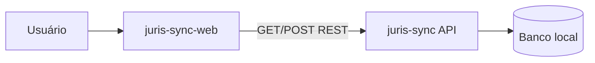

# Documentação Técnica e Funcional - JurisSync Web

> Este documento complementa o [README.md](../README.md) (visão geral, stack, execução) com requisitos funcionais e técnicos do dashboard: domínio de UI, regras de interação, histórias de usuário, critérios de aceite e rastreabilidade requisito → código → teste. Foi elaborado a partir do código em `src/`, contrato HTTP da API irmã e fluxos de demo documentados no [guia do testador](guia-do-testador.md).

---

## Índice

1. [Visão do produto](#1-visão-do-produto)
2. [Glossário](#2-glossário)
3. [Atores e integrações](#3-atores-e-integrações)
4. [Regras de interface e jurimetria](#4-regras-de-interface-e-jurimetria)
5. [Histórias de usuário](#5-histórias-de-usuário)
6. [Cenários BDD (Gherkin)](#6-cenários-bdd-gherkin)
7. [Regras de validação (cliente)](#7-regras-de-validação-cliente)
8. [Requisitos não funcionais](#8-requisitos-não-funcionais)
9. [Rastreabilidade requisito → código → teste](#9-rastreabilidade-requisito--código--teste)

---

## 1. Visão do produto

O **JurisSync Web** é o dashboard em Next.js que consome a [API JurisSync](https://github.com/MariaHilmar/juris-sync). Permite sincronizar processos judiciais por número CNJ, listar a base local, ver detalhe com timeline de movimentações e explorar jurimetria (mapa por UF, gráficos por tribunal e assunto) com **filtros cruzados** na tela inicial.

**Problema que resolve:** expor de forma visual e navegável os dados já persistidos pela API, sem exigir Swagger ou curl, adequado para avaliação de portfólio (clone + run local).

**Escopo de portfólio:** não há autenticação, SLA nem hardening para ambiente público. O header exibe **Portfólio Maria Hilmar Gomes** como contexto de vitrine técnica.

**Fora de escopo (v1):** login, edição manual de processos, notificações, BFF/proxy Next.js, testes e2e Playwright, geração automática de cliente OpenAPI.

---

## 2. Glossário

| Termo | Definição |
|-------|-----------|
| **Dashboard / Visão Geral** | Rota `/` com KPIs, mapa do Brasil, gráficos e filtros cruzados |
| **Cross-filter** | Seleção em um gráfico (UF ou assunto) que recalcula os demais componentes |
| **UF** | Unidade federativa; no mapa, agregação de tribunais estaduais (TJ*) via sigla → UF |
| **Modo mock** | API sem `DATAJUD_API_KEY`; dados determinísticos a partir do CNJ |
| **Modo real** | API com chave DataJud; sincronização consulta o CNJ quando possível |
| **Seed de demo** | Script `juris-sync/scripts/seed_demo.py` que popula 116 processos em 27 UFs |
| **TanStack Query** | Camada de cache e invalidação após mutations (ex.: sync) |

---

## 3. Atores e integrações

| Ator | Interação |
|------|-----------|
| **Visitante / avaliador** | Navega no dashboard local (`localhost:3000`) |
| **API JurisSync** | Fonte única de dados via REST (`NEXT_PUBLIC_JURISSYNC_API_URL`) |
| **DataJud (indireto)** | Acessado apenas pela API; o frontend não chama o CNJ |



**Endpoints consumidos pelo frontend:**

| Método | Caminho | Uso |
|--------|---------|-----|
| `GET` | `/health` | Status da API e modo DataJud |
| `GET` | `/api/v1/processos/` | Lista paginada (tela Processos) |
| `GET` | `/api/v1/processos/{id}` | Detalhe + movimentações |
| `POST` | `/api/v1/processos/sync` | Sincronizar por CNJ |

O dashboard carrega **todos os processos** (paginado, 100 por página) na Visão Geral via `useAllProcessos` e agrega jurimetria no cliente (`lib/jurimetria.ts`). Os endpoints `/stats/por-tribunal` e `/stats/por-assunto` existem na API, mas o frontend não os consome - a agregação é feita localmente para suportar cross-filter.

---

## 4. Regras de interface e jurimetria

### RN-F01 - Dados dos gráficos vêm da API
Nenhum gráfico usa dados estáticos embutidos no bundle. Tudo reflete processos persistidos após sync (mock ou real).

### RN-F02 - Agregação por UF só inclui TJ*
Tribunais federais/trabalhistas (ex.: TRF, TRT) não entram no mapa choropleth; apenas siglas mapeadas em `TRIBUNAL_TO_UF`.

### RN-F03 - Cross-filter por dimensão
- Filtro **UF** afeta gráficos de tribunal e assunto; o mapa mantém todas as UFs visíveis mas respeita filtro de assunto (se houver).
- Filtro **assunto** afeta mapa e tribunal; o gráfico de assuntos mantém todos os assuntos visíveis mas respeita filtro de UF (se houver).
- UF e assunto podem ser **combinados**.

> Código: `processosForUfChart`, `processosForAssuntoChart`, `filterProcessos` em `src/lib/jurimetria.ts`.

### RN-F04 - Limpar filtros
Os filtros são limpos quando o usuário:
- clica fora da área dos gráficos (listener em `document`);
- clica no fundo vazio do mapa;
- clica na área vazia do gráfico de assuntos;
- usa o botão **Limpar filtros**;
- clica novamente na mesma UF ou no mesmo assunto (toggle).

### RN-F05 - Mapa interativo
O mapa suporta zoom (+/−, roda do mouse), pan (arrastar com zoom > 100%), rótulos com sigla e total por estado, ranking lateral e seleção de UF por clique.

### RN-F06 - Header fixo
Menu superior fixo com marca JurisSync, subtítulo de portfólio e navegação **Visão Geral** | **Processos**. Conteúdo principal tem offset (`pt-[7.25rem]`) para não ficar oculto.

### RN-F07 - Invalidação após sync
Após `POST /sync` bem-sucedido, invalidar queries de processos, stats (legado) e health para refletir novos dados.

### RN-F08 - Mensagens de erro em PT-BR
Falhas de rede e HTTP são traduzidas em `lib/api/client.ts` e `lib/errors.ts`.

---

## 5. Histórias de usuário

### HU01 - Ver status e KPIs

**Como** visitante  
**Quero** ver status da API, total de processos e modo DataJud  
**Para** saber se o ambiente está saudável e qual fonte de dados está ativa

**Critérios de aceite:**
- Card com total de processos (filtrado ou total da base)
- Card com UFs no recorte atual
- Badge de status (`healthy` / outros) e versão da API
- Indicador **Mock (demo)** ou **Configurada** conforme `/health`

**Implementação:** `DashboardView`, `useHealth`, `useAllProcessos`

---

### HU02 - Explorar jurimetria com mapa e gráficos

**Como** visitante  
**Quero** ver distribuição por UF, tribunal e assunto  
**Para** entender concentração geográfica e temática dos processos

**Critérios de aceite:**
- Mapa do Brasil (choropleth) com totais por UF
- Gráfico de barras por tribunal
- Gráfico horizontal por assunto
- Estados vazios orientam a sincronizar ou rodar seed

**Implementação:** `BrazilMapChart`, `TribunalChart`, `AssuntoChart`, `lib/jurimetria.ts`

---

### HU03 - Filtrar gráficos por UF e assunto (cross-filter)

**Como** visitante  
**Quero** clicar em uma UF ou assunto e ver os demais gráficos atualizados  
**Para** explorar correlações sem sair da Visão Geral

**Critérios de aceite:**
- Clique em UF (mapa ou ranking) aplica filtro e destaca seleção
- Clique em barra de assunto aplica filtro
- Chips mostram filtros ativos; botão limpar remove todos
- Instruções visíveis na tela explicam o comportamento
- Clique fora da área dos gráficos limpa filtros

**Implementação:** `DashboardView` (estado `filters`), `BrazilMapChart`, `AssuntoChart`

---

### HU04 - Listar e filtrar processos

**Como** usuário  
**Quero** listar processos com filtros de tribunal/classe e paginação  
**Para** localizar processos na base

**Critérios de aceite:**
- Tabela com CNJ, tribunal, classe, assunto, grau, data
- Filtros enviados como query params à API
- Paginação `limit=20`
- Link para detalhe por linha

**Implementação:** `ProcessosView`, `ProcessFilters`, `ProcessTable`, `useProcessos`

---

### HU05 - Ver detalhe e timeline

**Como** usuário  
**Quero** ver ficha completa e movimentações  
**Para** acompanhar andamentos

**Critérios de aceite:**
- Metadados do processo
- Timeline por `data_hora` decrescente
- 404 com mensagem e retorno à lista

**Implementação:** `ProcessoDetailView`, `Timeline`, `useProcesso`

---

### HU06 - Sincronizar processo por CNJ

**Como** usuário  
**Quero** informar CNJ e grau para sincronizar  
**Para** popular a base (mock ou DataJud)

**Critérios de aceite:**
- Validação Zod do formato CNJ antes do submit
- Grau 1, 2 ou 3
- Sucesso redireciona para `/processos/{id}`
- Erros 422/500 exibidos de forma amigável
- Dashboard atualiza após invalidação de cache

**Implementação:** `SyncForm`, `useSyncProcesso`, `lib/validators/cnj.ts`

---

## 6. Cenários BDD (Gherkin)

### Cenário: Dashboard com seed de demo

```gherkin
Dado que a API está em modo mock com seed_demo aplicado
Quando o usuário abre a Visão Geral
Então deve ver mais de 100 processos nos KPIs
E o mapa deve exibir UFs com totais diferentes
E os gráficos de tribunal e assunto devem estar preenchidos
```

### Cenário: Cross-filter por UF

```gherkin
Dado que existem processos em SP e RJ
Quando o usuário clica em SP no mapa
Então o chip "UF: SP" deve aparecer
E o gráfico por tribunal deve mostrar apenas tribunais de SP
E o gráfico por assunto deve refletir apenas processos de SP
```

### Cenário: Limpar filtros clicando fora

```gherkin
Dado que o filtro UF SP está ativo
Quando o usuário clica fora da área dos gráficos
Então não deve haver filtros ativos
E os KPIs devem voltar ao total da base
```

### Cenário: Sync e atualização

```gherkin
Dado que o usuário está em Processos
Quando sincroniza um CNJ válido no modo mock
Então é redirecionado ao detalhe do processo
E ao voltar à Visão Geral os totais incluem o novo processo
```

---

## 7. Regras de validação (cliente)

| Campo | Regra | Arquivo |
|-------|--------|---------|
| `numero_cnj` | `^[0-9]{7}-[0-9]{2}\.[0-9]{4}\.[0-9]\.[0-9]{2}\.[0-9]{4}$` | `lib/validators/cnj.ts` |
| `grau` | Inteiro 1, 2 ou 3 | `SyncForm.tsx` (Zod) |

Alinhado ao schema Pydantic da API (`juris-sync/app/schemas/process.py`).

---

## 8. Requisitos não funcionais

| ID | Requisito |
|----|-----------|
| RNF01 | TypeScript strict; `npm run typecheck` sem erros |
| RNF02 | ESLint via `npm run lint` |
| RNF03 | Testes unitários Vitest (`npm run test`) |
| RNF04 | CI GitHub Actions: lint, typecheck, test, build |
| RNF05 | Responsivo: mapa e gráficos em grid adaptável |
| RNF06 | Acessibilidade básica: `aria-label` no mapa, `aria-pressed` no ranking |
| RNF07 | CORS: API com `BACKEND_CORS_ORIGINS=*` em dev |

---

## 9. Rastreabilidade requisito → código → teste

| Requisito | Componente / módulo | Endpoint / dado | Teste automatizado |
|-----------|----------------------|-----------------|-------------------|
| HU01 | `DashboardView`, `useHealth` | `GET /health` | manual |
| HU02 | `BrazilMapChart`, `TribunalChart`, `AssuntoChart` | `GET /processos` (all) | `tribunal-uf.test.ts` |
| HU03 | `DashboardView`, `jurimetria.ts` | agregação cliente | manual (recomendado: `jurimetria.test.ts`) |
| HU04 | `ProcessosView` | `GET /processos/` | manual |
| HU05 | `ProcessoDetailView` | `GET /processos/{id}` | manual |
| HU06 | `SyncForm` | `POST /processos/sync` | `cnj.test.ts`, `SyncForm.test.tsx` |
| Erros HTTP | `lib/api/client.ts` | todos | `client.test.ts` |
| RN-F06 | `AppHeader`, `layout.tsx` | - | manual |

---

## Documentação relacionada

- [Arquitetura](arquitetura.md)
- [Guia do testador](guia-do-testador.md)
- [ADR 0001 - Cliente separado](adr/0001-nextjs-cliente-separado.md)
- [Requisitos da API](https://github.com/MariaHilmar/juris-sync/blob/main/docs/requisitos.md)
